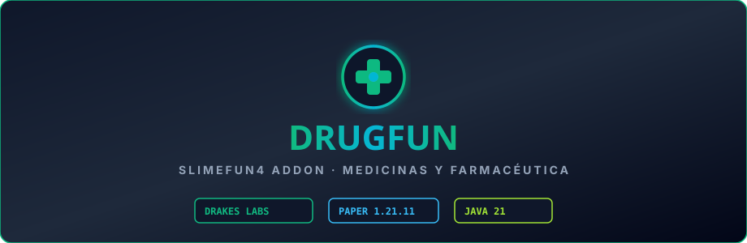

  

# Drugfun

Addon de **Slimefun 4** que añade un sistema avanzado de **productos farmacéuticos, medicinas y suplementos médicos**. Permite a los jugadores sintetizar fármacos con efectos temporales de regeneración, resistencia y agilidad, gestionando tiempos de expiración y límites de consumo seguro. Portado, limpiado de chino y mantenido por **DrakesCraft Labs** para Paper/Purpur 1.21.11 en Java 21.

---

## 🎯 Objetivo

Ampliar la rama de alquimia médica en Slimefun, ofreciendo suplementos de combate, analgésicos de exploración y tratamientos curativos sin desbalancear el PvP.

---

## ⚡ Características Principales

- **Farmacología Personalizable**:
  - Catálogo de medicamentos con efectos de poción combinados y duraciones escalonadas.
- **Sistema de Expiración y Sobredosis**:
  - Mecánica que penaliza el consumo excesivo con efectos temporales de fatiga o náusea para evitar abusos en combate.
- **Laboratorio de Química Médica**:
  - Recetas de extracción botánica y síntesis química en estaciones de trabajo Slimefun.
- **Traducción Depurada**:
  - Configuración y mensajes de juego totalmente en español.

---

## 🛠️ Entorno y Compatibilidad

- **Servidor**: Paper / Purpur 1.21.11
- **Java**: 21
- **Dependencias**:
  - `Slimefun4-Drake`

---

## 📜 Créditos y Origen

- **Autor original**: Comunidad Slimefun / `haiman233`
- **Adaptación y Mantenimiento 1.21.11**: **DrakesCraft Labs**
